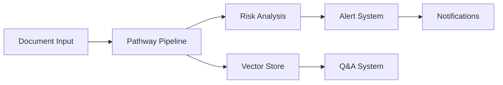

# ComplianceVision 🔍

[](https://compliancevision.streamlit.app)
[](https://www.python.org/downloads/)
[](https://opensource.org/licenses/MIT)
[](https://github.com/pathwaycom/llm-app)

> A real-time financial compliance monitoring system powered by AI, built for the Pathway: Real-Time RAG Playground Hackathon.


## 🌟 Features

### 🔄 Real-Time Monitoring
- **Multi-Jurisdiction Coverage**: US, EU, India, Asia, Global regulations
- **Live Risk Assessment**: Automated 0-1 risk scoring
- **Instant Alerts**: SMS, Email, Slack notifications
- **Document Analysis**: Real-time processing of financial documents

### 📊 Interactive Dashboard
- **Risk Visualization**: Dynamic charts and metrics
- **Jurisdiction Analysis**: Region-specific compliance tracking
- **Document Management**: Upload, track, and analyze documents
- **Alert Management**: Configure and manage notification preferences

### 🤖 AI-Powered Features
- **Smart Q&A System**: Context-aware compliance guidance
- **Risk Analysis**: AI-driven risk assessment
- **Document Processing**: Automated information extraction
- **Regulatory Updates**: Real-time compliance changes tracking

## 🚀 Quick Start

### Prerequisites
- Python 3.11+
- Git
- Twilio Account (for SMS notifications)
- Slack Webhook (optional)

### Installation

1. **Clone the repository**
```bash
git clone https://github.com/yourusername/ComplianceVision.git
cd ComplianceVision
```

2. **Set up virtual environment**
```bash
python -m venv venv
source venv/bin/activate  # On Windows: venv\Scripts\activate
```

3. **Install dependencies**
```bash
pip install -r requirements.txt
```

4. **Configure environment variables**
```bash
# Create .env file
cp .env.example .env

# Add your credentials
TWILIO_ACCOUNT_SID=your_account_sid
TWILIO_AUTH_TOKEN=your_auth_token
TWILIO_FROM_NUMBER=your_twilio_number
SLACK_WEBHOOK_URL=your_slack_webhook_url
```

5. **Run the application**
```bash
streamlit run app.py
```

## 🛠️ Architecture

### Technology Stack
- **Frontend**: Streamlit
- **Backend**: Python, Pathway
- **AI/ML**: OpenAI GPT-4, Embeddings
- **Search**: Hybrid (Vector + BM25)
- **Notifications**: Twilio, Slack
- **Deployment**: Docker, Streamlit Cloud

### System Components


## 📱 Features in Detail

### Document Analysis
- Real-time document processing
- Automated risk scoring
- Jurisdiction classification
- Key information extraction

### Risk Assessment
- **High Risk** (0.8-1.0): Immediate attention required
- **Medium Risk** (0.6-0.7): Monitoring needed
- **Low Risk** (0.4-0.5): Regular review
- **Compliant** (<0.4): Meeting requirements

### Notification System
- SMS alerts via Twilio
- Slack channel notifications
- Email notifications
- Custom alert thresholds

## 🔒 Security

- **Document Security**: Encrypted storage
- **Access Control**: Role-based authentication
- **Audit Logging**: Complete activity tracking
- **Data Protection**: Compliance with privacy standards

## 🌐 API Integration

### Available Endpoints
- `/analyze`: Document analysis
- `/alert`: Notification triggers
- `/query`: Q&A system
- `/metrics`: System statistics

## 📈 Use Cases

### Financial Institutions
- Regulatory compliance monitoring
- Risk assessment automation
- Real-time alert system
- Compliance reporting

### Compliance Officers
- Document analysis
- Risk tracking
- Regulatory updates
- Audit trail maintenance

### Risk Management Teams
- Risk monitoring
- Alert management
- Jurisdiction tracking
- Compliance oversight

## 🤝 Contributing

We welcome contributions! Please follow these steps:

1. Fork the repository
2. Create a feature branch
```bash
git checkout -b feature/AmazingFeature
```
3. Commit your changes
```bash
git commit -m 'Add some AmazingFeature'
```
4. Push to the branch
```bash
git push origin feature/AmazingFeature
```
5. Open a Pull Request

## 📝 License

This project is licensed under the MIT License - see the [LICENSE](LICENSE) file for details.

## 🏆 Acknowledgments

- Built for the [Pathway: Real-Time RAG Playground Hackathon](https://github.com/pathwaycom/llm-app)
- Powered by [Streamlit](https://streamlit.io)
- AI capabilities by [OpenAI](https://openai.com)
- Notifications by [Twilio](https://twilio.com)

## 📞 Support

For support, please:
- Open an [Issue](https://github.com/yourusername/ComplianceVision/issues)
- Contact: your.email@example.com
- Documentation: [Wiki](https://github.com/yourusername/ComplianceVision/wiki)

---
Built with ❤️ for the Pathway: Real-Time RAG Playground Hackathon 